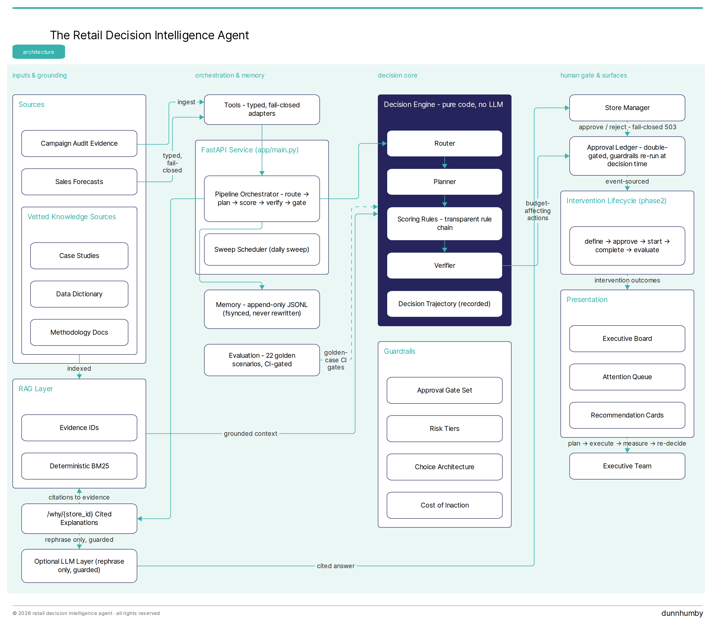

# Retail Decision Intelligence Agent

A deterministic decision-intelligence agent for retail store recovery. The
brain is code, not a model call: every recommendation is recomputable by
hand, citable by ID, and approved by a human before any budget moves. It
closes the loop **plan → execute → measure → re-decide** for underperforming
stores.

[](https://github.com/ashishkumar-ds/retail-decision-intelligence-agent/actions/workflows/ci.yml)
[](https://www.python.org)
[](https://docs.astral.sh/ruff)
[](LICENSE)

- **Deterministic by design** — pure-code decision path, no LLM.
- **Human-gated by default** — budget-affecting writes fail closed (503) without approval.
- **Grounded explanations** — `/why/{store_id}` cites exact evidence; the LLM only rephrases, under the same guards.
- **Golden-case gated** — 22 pinned scenarios run in CI; recalibration updates them in the same commit.

## Quickstart

Requires Python 3.10+.

```bash
git clone https://github.com/ashishkumar-ds/retail-decision-intelligence-agent.git
cd retail-decision-intelligence-agent

python -m venv .venv && source .venv/bin/activate
pip install -e ".[dev]"

pytest                          # full suite incl. live-API smoke tests (see LLM section to run fully offline)
uvicorn app.main:app --port 8001
```

Optional quality gates (the same ones CI runs):

```bash
ruff check .                    # lint gate
python scripts/check.py         # cross-module consistency gate
python evaluation/run_evals.py  # 22 golden business scenarios
```

Run in Docker with the autonomous daily sweep enabled:

```bash
APPROVAL_AUTH_TOKEN=change-me docker compose up -d --build
curl http://localhost:8001/health
```

## How a decision is made

Every store evaluation runs a fixed pipeline — `route → plan → score →
verify → approval gate` — with each stage recorded in a `DecisionTrajectory`
embedded in the recommendation record itself.


*The decision path is pure code with no LLM; the optional LLM layer sits off-path and may only rephrase grounded, cited explanations. (Themed after dunnhumby's "The Complete Journey" user guide.)*

The component map — pipeline, decision engine, memory, lifecycle, ledger,
guardrails, tools, RAG, evaluation, stakeholder surfaces — lives in the
[project blueprint](docs/PROJECT_BLUEPRINT.md), the full architecture record.

## API surface

| Endpoint | Method | Purpose |
| --- | --- | --- |
| `/health` | GET | Liveness + sweep-scheduler status |
| `/recommendations` | GET | Latest recommendations (read-only) |
| `/recommendations/run` | POST | Recompute and persist (auth) |
| `/board`, `/board/view`, `/cards/*` | GET | Executive board and recommendation cards |
| `/why/{store_id}` | GET | Grounded, cited explanation |
| `/advisory/{store_id}` | GET | LLM triage suggestion above the human gate (read-only, never auto-applied) |
| `/simulate/{store_id}` | GET | Pre-approval backtest: calibrated causal prior replayed on the observed baseline |
| `/pending-approvals`, `/attention-queue` | GET | Approval queue and triage digest |
| `/approve/{store_id}`, `/reject/{store_id}` | POST | Human decision (auth) |
| `/phase2/interventions/*` | GET/POST | Intervention lifecycle: define, events, checkpoints, outcome (auth on writes) |
| `/phase2/portfolio/evaluate` | POST | Portfolio-level evaluation (auth) |
| `/monitor/sweep` | POST | On-demand recovery sweep (auth) |
| `/log` | GET | Append-only recommendation log |

All state-mutating endpoints require `Authorization: Bearer <token>` where
the token comes from `APPROVAL_AUTH_TOKEN`. If the token is unset, these
endpoints refuse to serve (503) rather than allow unauthenticated writes.

## Configuration

| Variable | Default | Purpose |
| --- | --- | --- |
| `APPROVAL_AUTH_TOKEN` | unset (fail-closed) | Bearer token for all state-mutating endpoints |
| `FORECAST_API_URL` | deployed forecast API | Shared forecast service base URL |
| `CAMPAIGN_AUDIT_LOG_PATH` | unset | Path to Project 2 `audit_log.jsonl` |
| `CAMPAIGN_AUDIT_API_URL` | unset | Opt-in read-only audit HTTP endpoint (takes precedence over the file) |
| `RECOMMENDATION_LOG_PATH` | `logs/recommendation_log.jsonl` | Append-only recommendation log location |
| `PENDING_APPROVAL_STATE_PATH` | `logs/pending_approvals.db` | Durable SQLite pending-approval queue (multi-worker safe) |
| `SWEEP_ENABLED` / `SWEEP_INTERVAL_SECONDS` | off / `86400` | Opt-in background sweep scheduler |
| `LLM_ADVISORY_ENABLED` / `LLM_EXPLANATIONS_ENABLED` | off / off | Opt-in LLM layers (advisory triage / narrative rephrase); both fail closed to deterministic output |
| `PORT` | `8001` | FastAPI listen port |

### Free LLM setup (Groq / Gemini / Ollama)

The LLM layers work with any OpenAI-compatible endpoint - no paid API needed:

```bash
# Groq (free tier): get a key at https://console.groq.com
export LLM_PROVIDER=openai_compat
export LLM_BASE_URL=https://api.groq.com/openai/v1
export LLM_API_KEY=gsk_...
export LLM_MODEL=llama-3.3-70b-versatile

# Or fully offline with Ollama (no key at all):
# export LLM_BASE_URL=http://localhost:11434/v1
# export LLM_MODEL=llama3.2
# export LLM_API_KEY=ollama   # any non-empty value; Ollama ignores it

export LLM_ADVISORY_ENABLED=true LLM_EXPLANATIONS_ENABLED=true
```

Grounding guards apply identically to any provider: a free model that
hallucinates numbers or invents citations is rejected and the endpoint
serves the deterministic output instead.

## Documentation

- [Whitepaper](docs/WHITEPAPER.md) — the P1 → P2 → P3 series and this agent's place in it
- [Project blueprint](docs/PROJECT_BLUEPRINT.md) — architecture record; capabilities marked implemented/planned
- [Safety](docs/SAFETY.md) — canonical list of every safety gate, its rule, and failure mode
- [Phase 2 spec](docs/PHASE_2_SPEC.md) — the intervention lifecycle contract
- [LLM integration patterns](docs/LLM_INTEGRATION_PATTERNS.md) — how the optional LLM layer is quarantined
- [Market benchmark](docs/market_benchmark_retail_di.md) — positioning against commercial retail-DI platforms

## Contributing

Keep the decision path deterministic: a change that alters a recommendation
must update the pinned golden cases in the same commit, with the rationale
stated. Run `ruff check .`, `pytest`, and `python scripts/check.py` before
opening a PR — CI runs all three plus a Docker build smoke test.

## License

MIT — see [LICENSE](LICENSE).
