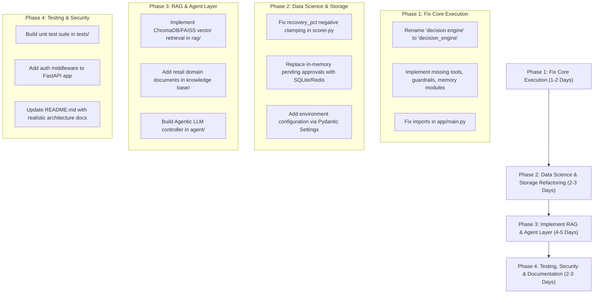

# Comprehensive Audit & Code Review: Retail Decision Intelligence Agent

> **Review Mode**: Review-Only Pass (No source code or application files modified).

---

## 1. Executive Summary & Repository Inventory

This repository is intended to represent **Project 3: Retail Decision Intelligence Agent**, building on store recovery and campaign automation workflows. 

An exhaustive file-system audit reveals that **the repository is an incomplete, unrunnable code skeleton**. Out of 10 subdirectories in the project, **9 contain only a 1-byte blank `README.md` file**. Core claimed architectural pillars—including **RAG**, **AI Agents**, **Tool Implementations**, **Knowledge Base**, **Guardrails**, **Memory**, **Evaluation Suites**, and **Unit Tests**—are **100% missing**.

### File Inventory
* [`README.md`](file:///root/projects/retail-decision-intelligence-agent/README.md): 16-line high-level overview.
* [`requirements.txt`](file:///root/projects/retail-decision-intelligence-agent/requirements.txt): Minimal file with 3 dependencies (`fastapi`, `uvicorn`, `requests`).
* [`app/main.py`](file:///root/projects/retail-decision-intelligence-agent/app/main.py): FastAPI application routing logic (**fails on startup due to missing modules and invalid directory paths**).
* [`decision engine/router.py`](file:///root/projects/retail-decision-intelligence-agent/decision%20engine/router.py): Deterministic store routing logic.
* [`decision engine/planner.py`](file:///root/projects/retail-decision-intelligence-agent/decision%20engine/planner.py): Lookup table mapping routes to execution step keys.
* [`decision engine/scorer.py`](file:///root/projects/retail-decision-intelligence-agent/decision%20engine/scorer.py): Heuristic score calculation and recommendation rule engine.
* [`decision engine/verifier.py`](file:///root/projects/retail-decision-intelligence-agent/decision%20engine/verifier.py): Output validator.
* **Empty Subdirectories (1-byte blank `README.md` only)**:
  `agent/`, `app/`, `decision engine/`, `docs/`, `evaluation/`, `knowledge base/`, `rag/`, `tests/`, `tools/`.

---

## 2. Evaluation Across 20 Required Dimensions

### 1. Overall Architecture
* **Status**: Critical Failure / Non-Executable.
* The application defines a multi-stage flow (`route` $\rightarrow$ `plan` $\rightarrow$ `score` $\rightarrow$ `verify` $\rightarrow$ `approval_check` $\rightarrow$ `log`). However, because key components (`guardrails`, `memory`, `tools`) do not exist, and the `decision engine` directory contains a space character, the application crashes immediately upon `import app.main`.

### 2. Data Flow (Input $\rightarrow$ Retrieval $\rightarrow$ Reasoning $\rightarrow$ Decision $\rightarrow$ Recommendation)
* **Status**: Severely Broken.
* Input retrieval relies on imported functions `get_audit_log()` and `get_prediction()` from `tools.campaign_tool` and `tools.forecast_tool` which do not exist. Data processing falls back to zero-state signals when calls fail. Output logging writes directly to unconfigured relative local paths (`logs/run_log.jsonl`).

### 3. RAG Implementation
* **Status**: 0% Implemented.
* The [`rag/`](file:///root/projects/retail-decision-intelligence-agent/rag/README.md) directory contains only an empty `README.md`. There are zero vector stores, embeddings, retrieval algorithms, document parsers, or chunking mechanisms.

### 4. Agent Architecture
* **Status**: 0% Implemented.
* The [`agent/`](file:///root/projects/retail-decision-intelligence-agent/agent/README.md) directory contains only an empty `README.md`. No LLM orchestrator, LangChain/LlamaIndex/CrewAI agent, or system loop exists.

### 5. Tool-calling Design
* **Status**: 0% Implemented (Phantom Imports).
* The [`tools/`](file:///root/projects/retail-decision-intelligence-agent/tools/README.md) directory is empty. [`app/main.py`](file:///root/projects/retail-decision-intelligence-agent/app/main.py#L24-L25) imports `campaign_tool` and `forecast_tool` from `tools`, triggering immediate `ModuleNotFoundError` crashes.

### 6. Decision-Engine Logic
* **Status**: Present, but Naive & Uncalibrated.
* Located in `decision engine/`. Uses hardcoded threshold rules (`health >= 70`, `health < 40`, `velocity <= 0`). While deterministic, the scoring logic relies on arbitrary linear heuristics rather than statistical models.

### 7. Prompt Design
* **Status**: 0% Implemented.
* Zero prompts, system instructions, or context formatting templates exist in the entire codebase.

### 8. Evaluation Methodology
* **Status**: 0% Implemented.
* The [`evaluation/`](file:///root/projects/retail-decision-intelligence-agent/evaluation/README.md) directory is completely empty. No benchmark datasets, ground truth assertions, RAG metrics (Faithfulness, Answer Relevance), or agent decision quality evaluations exist.

### 9. Data-Science / Analytics Methodology
* **Status**: Flawed Heuristics.
* In [`scorer.py`](file:///root/projects/retail-decision-intelligence-agent/decision%20engine/scorer.py#L31-L45):
  * Negative recovery percentage (store performance declining) is truncated to `0.0` by `max(recovery_pct / 30.0, 0.0)`, treating a store down -50% identically to a store down 0%.
  * Recovery component saturates (maxes out) at 30% recovery.
  * Completeness component awards 20 points simply because data exists, distorting performance metrics.
  * Confidence is derived from an ad-hoc distance to boundary formula (`0.5 + nearest / 40`) with no probabilistic backing.

### 10. Python Code Quality
* **Status**: Low / Unimportable.
* Directory names with spaces (`decision engine`) prevent valid Python imports (`from decision_engine.router import route`). Type annotations are inconsistent across modules.

### 11. Error Handling
* **Status**: Partial & Masked.
* [`app/main.py`](file:///root/projects/retail-decision-intelligence-agent/app/main.py#L75-L98) catches `requests.RequestException` and `KeyError` during forecast retrieval, but silently substitutes a default `StoreSignal(store_id, 0, 0, days_elapsed, days_remaining, False)`.

### 12. Configuration Management
* **Status**: Non-existent.
* Hardcoded values are spread throughout the codebase (`RECOVERY_WINDOW_DAYS = 60`, `RUN_LOG_PATH = Path("logs/run_log.jsonl")`, `port = 8001`). No environment variable loaders (`pydantic-settings` or `python-dotenv`) exist.

### 13. Dependency Management
* **Status**: Inadequate.
* [`requirements.txt`](file:///root/projects/retail-decision-intelligence-agent/requirements.txt) lists only `fastapi`, `uvicorn`, and `requests`. Missing critical libraries: `pydantic`, `pandas`, `numpy`, `pytest`, `openai`/`anthropic`/`google-genai`, `chromadb`/`faiss`.

### 14. Testing and Test Coverage
* **Status**: 0% Coverage.
* The [`tests/`](file:///root/projects/retail-decision-intelligence-agent/tests/README.md) directory contains only an empty `README.md`. No unit, integration, or end-to-end test cases exist.

### 15. Security
* **Status**: High Risk.
* State mutation endpoints (`POST /approve/{store_id}` and `POST /reject/{store_id}`) are completely unauthenticated. No CORS middleware, rate limiting, or input validation schemas are present.

### 16. Performance
* **Status**: Bottlenecked.
* [`get_recommendations()`](file:///root/projects/retail-decision-intelligence-agent/app/main.py#L139-L167) processes store IDs sequentially in a blocking `for` loop, making synchronous HTTP requests for baseline and current forecasts for every store.

### 17. Maintainability
* **Status**: Poor.
* Code cannot run due to broken package structures, missing modules, and relative file system assumptions.

### 18. Documentation
* **Status**: Extremely Poor.
* Root [`README.md`](file:///root/projects/retail-decision-intelligence-agent/README.md) is 16 lines long. All 9 module sub-READMEs are empty (1 byte).

### 19. README Accuracy
* **Status**: Highly Misleading.
* Root [`README.md`](file:///root/projects/retail-decision-intelligence-agent/README.md#L5) claims the system "combines RAG, AI agents, tool calling, and a deterministic decision engine". In reality, RAG, AI agents, and tools are entirely missing from the codebase.

### 20. Portfolio / Recruiter Credibility
* **Status**: Severe Threat to Credibility.
* Presenting this repository to a hiring manager or tech lead will result in immediate rejection upon running `python -m app.main` or reviewing the directory structure.

---

## 3. Significant Issues Audit Report

### Issue 1: Broken Python Package Import Structure & Non-Existent Core Modules
* **Severity**: Critical
* **File**: [`app/main.py`](file:///root/projects/retail-decision-intelligence-agent/app/main.py#L18-L26) & [`decision engine/scorer.py`](file:///root/projects/retail-decision-intelligence-agent/decision%20engine/scorer.py#L6)
* **Problem**: 
  1. [`app/main.py`](file:///root/projects/retail-decision-intelligence-agent/app/main.py#L18) attempts `from decision_engine.router import route`, but the physical directory on disk is named `decision engine` (with a space).
  2. [`app/main.py`](file:///root/projects/retail-decision-intelligence-agent/app/main.py#L22-L25) imports `guardrails`, `memory.history`, `tools.campaign_tool`, and `tools.forecast_tool`. None of these files or directories exist.
* **Why It Matters**: The application cannot be launched, imported, or tested. Any execution attempt immediately throws a `ModuleNotFoundError` crash.
* **Recommended Solution**: 
  1. Rename `decision engine` directory to `decision_engine` (snake_case).
  2. Implement the missing modules (`guardrails.py`, `memory/history.py`, `tools/campaign_tool.py`, `tools/forecast_tool.py`).

### Issue 2: Misleading Architectural Claims (Phantom RAG & AI Agent)
* **Severity**: High
* **File**: [`README.md`](file:///root/projects/retail-decision-intelligence-agent/README.md#L5), [`rag/README.md`](file:///root/projects/retail-decision-intelligence-agent/rag/README.md), [`agent/README.md`](file:///root/projects/retail-decision-intelligence-agent/agent/README.md)
* **Problem**: The project claims to combine RAG, AI Agents, and Tool Calling. However, `rag/` and `agent/` directories are completely empty, and no LLM integration exists anywhere in the codebase.
* **Why It Matters**: Destroys technical credibility during code reviews and recruitment evaluations.
* **Recommended Solution**: Implement a genuine RAG pipeline (e.g., retrieval over retail policy docs using ChromaDB/FAISS) and an AI Agent layer, or accurately describe the current project scope.

### Issue 3: Methodologically Flawed Scoring Heuristic
* **Severity**: High
* **File**: [`decision engine/scorer.py`](file:///root/projects/retail-decision-intelligence-agent/decision%20engine/scorer.py#L31-L45)
* **Problem**: 
  * `compute_health_score` truncates negative performance (`recovery_pct < 0`) to 0 points (`max(recovery_pct / 30.0, 0.0)`).
  * Automatically grants 20 points simply because a forecast signal is present (`completeness_component`).
  * `_boundary_confidence` uses an arbitrary linear distance formula (`min(0.5 + nearest / 40, 1.0)`).
* **Why It Matters**: Underperforming stores that are actively losing sales are given identical baseline scores to stores with zero recovery. Confidence metrics are uncalibrated and mathematically meaningless.
* **Recommended Solution**: Normalize health scoring across negative ranges (e.g., [-100%, +100%]), separate data quality flags from performance metrics, and use calibrated logistic confidence or Bayesian scoring models.

### Issue 4: In-Memory Volatile Approval State
* **Severity**: Medium
* **File**: [`app/main.py`](file:///root/projects/retail-decision-intelligence-agent/app/main.py#L35)
* **Problem**: Pending store approvals are stored in a global Python dictionary `_pending_approvals = {}`.
* **Why It Matters**: Any server restart, crash, or multi-worker Uvicorn deployment (`uvicorn --workers 4`) will immediately lose all pending approvals or desynchronize state across workers.
* **Recommended Solution**: Persist pending approvals to a database (e.g., SQLite/PostgreSQL) or Redis state store.

### Issue 5: Unauthenticated State-Changing API Endpoints
* **Severity**: Medium
* **File**: [`app/main.py`](file:///root/projects/retail-decision-intelligence-agent/app/main.py#L174-L192)
* **Problem**: `POST /approve/{store_id}` and `POST /reject/{store_id}` have no authentication, authorization, or RBAC controls.
* **Why It Matters**: Anyone with network access can approve or reject recommendations without audit trails or role verification.
* **Recommended Solution**: Implement API Key or OAuth2 JWT authentication middleware and audit user identities during approval/rejection operations.

---

## 4. Categorized Audit Findings (A – J)

### A. What is genuinely strong
* **Clean Code Structure in Decision Engine**: The split between routing (`router.py`), planning (`planner.py`), scoring (`scorer.py`), and verification (`verifier.py`) reflects a good theoretical design pattern for a deterministic rule engine.

### B. What is unnecessarily complex
* **Over-engineered Directory Structure for Missing Code**: Having 10 top-level directories containing only empty 1-byte README files creates cognitive clutter without providing functionality.

### C. Potential bugs
* **Import Failures**: Space in directory name `decision engine` breaks `from decision_engine...`.
* **Missing Tool & Guardrail Imports**: `app/main.py` crashes on launch.
* **Unbounded File Writes**: `log_run_step` and `append_log` append infinitely to JSONL files without log rotation.

### D. Architectural weaknesses
* **Lack of State Persistence**: Pending approvals in global variable `_pending_approvals`.
* **Synchronous Execution Pipeline**: Processing store recommendations sequentially blocks FastAPI event loops.

### E. Data-science methodological weaknesses
* **Negative Truncation in Recovery Score**: `max(recovery_pct / 30.0, 0.0)` hides severe store performance drops.
* **Uncalibrated Confidence**: `_boundary_confidence` is a heuristic mockup rather than statistical probability.

### F. AI/RAG weaknesses
* **Complete Absence of AI/RAG**: RAG and Agent capabilities are non-existent despite being highlighted as primary features in [`README.md`](file:///root/projects/retail-decision-intelligence-agent/README.md).

### G. Security risks
* **Unauthenticated Endpoint Access**: Publicly accessible write/approval endpoints (`POST /approve/{store_id}`).
* **Hardcoded Relative Paths**: Vulnerable to directory traversal if paths are dynamically influenced.

### H. Testing gaps
* **0% Test Coverage**: Zero test files in [`tests/`](file:///root/projects/retail-decision-intelligence-agent/tests/README.md). No unit testing for scoring logic or API integration tests.

### I. Claims in README/docs not supported by implementation
* Claimed **RAG Layer**: Not implemented.
* Claimed **AI Agent**: Not implemented.
* Claimed **Tool Calling**: Not implemented (phantom imports).
* Claimed **Retail Knowledge Base**: Not implemented.

### J. Top 10 Improvements Ranked by Impact

| Rank | Improvement | Impact Level | Target Location |
| :--- | :--- | :--- | :--- |
| 1 | Fix directory name `decision engine` $\rightarrow$ `decision_engine` & resolve all imports | **Critical** | Root directory & [`app/main.py`](file:///root/projects/retail-decision-intelligence-agent/app/main.py) |
| 2 | Implement missing `tools`, `guardrails`, and `memory` modules | **Critical** | [`tools/`](file:///root/projects/retail-decision-intelligence-agent/tools/README.md), `guardrails.py`, `memory/` |
| 3 | Implement a genuine RAG pipeline (document ingestion, embeddings, retrieval) | **High** | [`rag/`](file:///root/projects/retail-decision-intelligence-agent/rag/README.md) & [`knowledge base/`](file:///root/projects/retail-decision-intelligence-agent/knowledge%20base/README.md) |
| 4 | Integrate an AI Agent framework for reasoning and tool dispatch | **High** | [`agent/`](file:///root/projects/retail-decision-intelligence-agent/agent/README.md) |
| 5 | Fix data science scoring heuristics (support negative recovery & remove arbitrary baseline points) | **High** | [`decision engine/scorer.py`](file:///root/projects/retail-decision-intelligence-agent/decision%20engine/scorer.py) |
| 6 | Add comprehensive unit and integration test suite using `pytest` | **High** | [`tests/`](file:///root/projects/retail-decision-intelligence-agent/tests/README.md) |
| 7 | Replace in-memory `_pending_approvals` dict with persistent database storage | **Medium** | [`app/main.py`](file:///root/projects/retail-decision-intelligence-agent/app/main.py) |
| 8 | Add authentication & authorization to FastAPI endpoints | **Medium** | [`app/main.py`](file:///root/projects/retail-decision-intelligence-agent/app/main.py) |
| 9 | Update `requirements.txt` with full dependencies (`pydantic`, `pytest`, `pandas`, LLM SDKs) | **Medium** | [`requirements.txt`](file:///root/projects/retail-decision-intelligence-agent/requirements.txt) |
| 10 | Update root `README.md` and module READMEs to accurately reflect system architecture | **Medium** | All `README.md` files |

---

## 5. Comprehensive Assessments & Roadmap

### 1. Executive Assessment
The **Retail Decision Intelligence Agent** project presents an ambitious architectural vision combining deterministic business logic with modern AI components. However, the codebase is currently in an unrunnable skeleton state. While the deterministic decision engine modules (`router`, `planner`, `scorer`, `verifier`) demonstrate structured design thinking, the application fails to run due to syntax/import errors, missing modules, and missing AI/RAG layers.

### 2. Architecture Assessment
The separation of responsibilities into `route` $\rightarrow$ `plan` $\rightarrow$ `score` $\rightarrow$ `verify` $\rightarrow$ `approve` is clean and well-conceived. However, the operational implementation suffers from broken module paths, unhandled asynchronous operations, local file path coupling, and volatile in-memory state.

### 3. Data-Science Assessment
The decision engine scoring logic is deterministic and easy to trace, but mathematically uncalibrated. Key issues include clamping negative recovery values to zero (masking store declines), awarding arbitrary points for signal presence, and relying on linear distance formulas for confidence estimation.

### 4. AI/RAG Assessment
RAG, AI Agent orchestration, and Tool Calling are completely absent from the codebase. To meet project claims, a complete vector indexing system, document store, prompt management framework, and agentic loop must be developed.

### 5. Engineering Assessment
Code quality is blocked by foundational errors: package directories containing spaces (`decision engine`), missing files referenced in import statements, missing configuration management, and missing standard dependencies in `requirements.txt`.

### 6. Testing Assessment
Testing coverage is currently **0%**. The [`tests/`](file:///root/projects/retail-decision-intelligence-agent/tests/README.md) directory contains no test scripts or fixtures.

### 7. Portfolio / Recruiter Credibility Assessment
In its present condition, sharing this repository will negatively impact candidate evaluation. Hiring managers or technical screeners running `python -m app.main` or `pytest` will encounter immediate crashes and unfulfilled architectural claims.

---

### 8. Prioritized Improvement Roadmap

